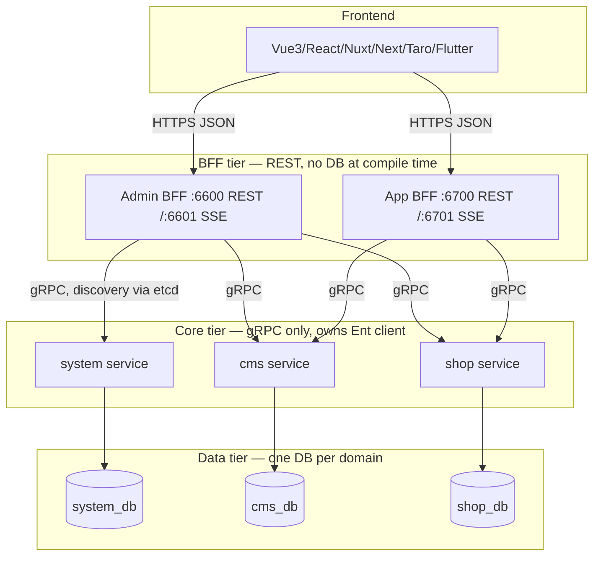

# Case Study 6 — tx7do's GoWind: A Publicly Shipped Reference Implementation

Unlike Approaches 1–5, this is not a proposal. It documents what tx7do (author of
`go-wind-cms`, `go-wind-admin`, `go-wind-shop`) has publicly shipped, why he says he made each
call, and what he reports broke along the way.

**Evidence status — read this before citing anything below.** Every claim here is
_self-reported_ by the author on his own site, corroborated only by public repositories, public
demo deployments, and commit hashes he cites himself. No production start date, operational
metric, uptime figure, tenant count, or independently measured scale is disclosed anywhere in
the corpus. Treat this as a publicly shipped reference implementation with a visible commit
history — not as an independently verified production system. Chinese quotes are
paraphrase-translated; read the originals before citing them externally.

### Source manifest

Retrieved 2026-08-22. Posts live at `https://tx7do.github.io/posts/<slug>.html`; the index is
[tx7do.github.io/article](https://tx7do.github.io/article/) and the product site is
[gowind.cloud](https://www.gowind.cloud/).

| Slug                                              | Used for                                           |
| ------------------------------------------------- | -------------------------------------------------- |
| `architecture-evolution-core-cms-shop`            | monolith-to-split retrospective (§1)               |
| `gowind-cms-core-bff-architecture`                | dual-BFF rationale, proto isolation (§2)           |
| `go-wind-shop-architecture-deep-dive`             | request path, Wire, layer omission (§2, §3)        |
| `go-wind-shop-overview-and-positioning`           | positioning, six artefact classes (§7)             |
| `go-wind-shop-security-and-production-readiness`  | security posture, admitted gaps (§6)               |
| `kratos_monolith_architecture`                    | Kratos-for-monolith argument, buf/Ent/Wire choices |
| `go-wind-cms-microservice-why-choose-kratos`      | framework selection criteria (§5)                  |
| `go_wind_admin_layer_desigin`                     | the three coexisting layering patterns (§4)        |
| `go_wind_admin_backend_project_struct`            | repository layout                                  |
| `go_wind_admin_code_gen`                          | `sql2orm` / `sql2proto` / `sql2kratos` (§7)        |
| `go-wind-toolkit-backend-full-code-generation`    | scaffold inputs and limits (§7)                    |
| `go_wind_admin_redact`                            | `protoc-gen-redact` annotations (§7)               |
| `go_wind_data_permission`                         | row/column data-scope design                       |
| `go_wind_api_aggregator`                          | BFF aggregation helpers                            |
| `kratos_api_design_guide`                         | proto/API conventions                              |
| `gowind-unified-paradigm-standardized-admin-api`  | frontend API layering                              |
| `go-wind-ai-development-framework-scaffold-value` | AI-friendliness argument (§8)                      |

Repositories referenced: `github.com/tx7do/go-wind-cms`, `github.com/tx7do/go-wind-admin`,
`github.com/tx7do/go-wind-shop`. Commit hashes below are cited by the author in the security
post; they are **not** pinned to a revision this document verified, and the source does not
state which repository each belongs to — verify against `go-wind-shop` before relying on them.

## TL;DR

- This is **Approach 2 (proto-as-DSL, generated edges) sitting on Approach 4's data layer**
  (Ent + privacy policies), with a hand-rolled BFF/Core split and no runtime action registry —
  Approach 3's Ash-style introspection does not exist here.
- Three products share one shape: **Core (gRPC-only, owns the DB) → BFF (REST, one per client
  scenario, zero DB access at compile time) → Frontend**. He evolved into this from a monolith
  under real production pain, not from a clean-slate design.
- Layering is a dial, not a mandate: he explicitly runs three different Service/Biz/Data
  patterns in the _same_ codebase depending on module complexity, and says picking the
  heaviest pattern everywhere is "premature abstraction."
- Security posture is fail-closed by construction (missing token → reject, unmapped strategy →
  reject) but he is unusually candid that the shipped defaults (JWT secret literally
  `"some_api_key"`, CORS `*`, EC keys committed, migrate:true) are dev-only and require
  operator work before production — the docs don't quietly assume "someone will change this."
- Use this case study to calibrate Approach 5's Stage 2/3: it proves the transport/validation/
  redaction generation half of Approach 2 is shippable at reference scale; it does **not** show
  authorization-decision, audit-chain, consent, or retention half — those are exactly the gap
  go-blocks has to fill that GoWind does not.

## Architecture overview

One `buf generate` run over an annotated proto produces six artefact classes: gRPC stubs, HTTP
stubs (via `protoc-gen-go-http`), Kratos-style typed errors (`protoc-gen-go-errors`), request
validators (`protoc-gen-validate`), PII redactors (`protoc-gen-redact`), and TypeScript HTTP
clients, plus a Gnostic-driven OpenAPI document. The BFF/Core boundary is encoded _in the
proto_: only BFF-facing proto packages carry `google.api.http` options; Core packages never do,
so a Core method has no directly generated HTTP endpoint. That is a codegen property, not a
reachability guarantee — the Core RPC is still reachable over gRPC by anything that can route to
it, and a hand-written gateway could expose it over HTTP. What actually keeps Core private is
network placement plus etcd registration for internal discovery only; the proto convention
removes the accidental path, not the deliberate one.

## Deep dive by component and decision

### 1. He didn't start here — the monolith-to-split story

`go-wind-cms` began as a single `Core` service handling both CMS (content) and, once Shop was
added, e-commerce — sharing one Ent client and one `wire_gen.go`. He is explicit that this was a
deliberate initial trade, not a mistake: _"用 Core 大包换开发效率，BFF 保持极致纯净"_ — trade
Core's size for development speed, keep BFF pristine — because a single-business scenario made
this "lightweight, simple to debug, and fully sufficient." Startup dependency wiring at this
stage initialized 30+ providers and took 30+ seconds.

It broke under real load once both domains were live concurrently: _"随着双业务并行迭代，Core
大包架构的技术债务彻底暴露"_ — the technical debt was "totally exposed" once both businesses
iterated in parallel. Three concrete failures, not a vague "it got messy":

- **Deploy coupling.** Any change, in either domain, forced a full redeploy of Core.
- **Resource contention.** Shop's transactional writes exhausted the shared DB connection pool,
  starving CMS's read traffic — a content page load could fail because someone was checking out.
- **Schema entanglement.** Ent mixed trading tables and content tables in one client, which made
  it impossible to tune each independently (index strategy, backup cadence, connection limits).

The fix was **not** a jump to fine-grained microservices. He explicitly rejects that too, citing
his own scale: daily active users under 100K, QPS under 1000. Introducing distributed
transactions (Seata, Saga) at that volume is, in his words, "指数上升" complexity for no payoff
— "excessive splitting is textbook over-engineering." The landing point was **coarse-grained
domain separation with per-service local transactions**: `system/service`, `cms/service`,
`shop/service`, each with its own Ent client and its own database, talking to shared BFFs that
were left untouched. Quote: _"按业务域粗粒度拆分服务...业务服务内部保留本地事务，用最低的分布式
代价，换取业务完全隔离，是中小团队最优解"_ — coarse domain splits with local transactions inside
each service trade minimal distributed cost for full business isolation; for a small/mid team,
that's the optimum, not microservices and not a monolith.

Concretely, splitting the databases meant **physical isolation, no cross-database joins**
(`三库完全独立，禁止跨库联表查询`), because trading data needs independently auditable backup and
access control that content data doesn't. He kept this bounded by discipline, not tooling: this
predates the row-level Ent privacy policies that later ship in `go-wind-shop` — in the CMS split
the isolation is _databases_, not _rows_.

**What go-blocks should take from this**: the ceiling for coarse-domain-with-local-transactions
is _stated with numbers_ (sub-100K DAU, sub-1000 QPS), not asserted vaguely. Approach 5's Stage
1→2 transition trigger should borrow this pattern — pick a measurable threshold, don't wait for
"it feels slow."

### 2. Why the BFF/Core split, and why it has to be two BFFs, not one

The reason he gives for the dual-BFF layer is structural, not stylistic: _"若前端直接连接
Core...Core 接口就被迫沦为万能适配器"_ — if frontends connect directly to Core, Core's
interfaces are forced to become "universal adapters" simultaneously serving backend full-field
management, web display, mobile trimming, and mini-program weak-network scenarios — and "the
architecture transformation fails completely" once that happens. This is the same failure mode
Approach 1 in this repo calls out as the reason interfaces must be consumer-defined and narrow:
one interface serving every caller degrades to `map[string]any`.

Given that, gRPC internally / REST externally is the obvious next call, and he states the
reasoning plainly rather than treating it as folklore: Protobuf's binary wire format is more
compact and cheaper to serialize than JSON. The resilience features he groups under the same
heading come from Kratos, not from Protobuf or gRPC themselves — service discovery from the
etcd registry (`registry.yaml`), and retry, circuit breaking, and timeouts from Kratos client
middleware (`client.yaml`'s `enable_circuit_breaker` and `timeout`, plus `retry.Middleware` and
`circuitbreaker.Middleware` on the gRPC dial options). The real saving is that Kratos ships
these for the gRPC transport, so no per-service wrapper gets written. REST at the edge exists because "all frontend ecosystems natively
support HTTP" while gRPC-Web needs special client tooling — unifying on gRPC at the edge would
have pushed unnecessary integration cost onto every frontend variant (four exist: Nuxt,
Next.js, Taro, Flutter).

**A structural rule expressed as a dependency-injection convention**: the BFF's Wire provider
set — at `backend/app/admin/service/internal/data/providers/wire_set.go` in the current public
`go-wind-cms` tree — contains _only_ Redis, MinIO, etcd discovery, and gRPC client factories:
no `NewXxxRepo`, no Ent client. Core alone wires an Ent client and its repository factories.
This is a convention, not a compile-time guarantee — Wire constrains the generated dependency
graph, but nothing stops another BFF file from importing Ent and constructing a client directly.
Approach 5's proposed CI import-graph check is the strictly stronger form of the same boundary;
tx7do gets the intent without the enforcement: _"这个约束的价值在于:把'数据落点'收敛到一处"_ — the value of this constraint is
converging the "point where data lands" to exactly one place, so that row-level isolation,
audit, and masking only ever need implementing once.

He names, and rejects, the two alternatives explicitly:

- **Monolith form**: single process, single DB, isolation "relies on developers remembering"
  `WHERE tenant_id = ? AND user_id = ?` on every query. One miss is a breach.
- **Pure microservices, each service exposing its own HTTP**: pushes N services' worth of auth,
  aggregation, and error handling onto the frontend, and scatters audit/auth logic across N
  independent implementations that will drift.

The three-service shape is the deliberate middle: _"用一跳网络 latency 和部署复杂度,换数据访问
收敛和鉴权审计一致性"_ — trade one network hop and deployment complexity for converged data
access and consistent auth/audit.

**A bypass this design has to actively suppress**: the BFF's HTTP middleware chain is where
auth and audit live, so any gRPC server in the same binary is a path around both. GoWind sets
`grpc.addr: "0.0.0.0:0"` and the author describes this as eliminating the bypass at compile
time — _"把端口设 0 从编译期就消除这个旁路"_.

**That description is wrong, and worth flagging rather than repeating.** Port 0 is not "no
server": the BFF still constructs the gRPC server, and Kratos still calls `net.Listen`, which
binds an ephemeral port on all local interfaces. The result is a live gRPC path outside the REST
middleware chain — harder to find, not absent. Closing it properly means not constructing the
gRPC server in the BFF binary at all, or enforcing a network policy that makes the port
unreachable. go-blocks should take the concern and reject the mechanism: this is exactly the
"an escape hatch must not become a silent bypass" failure mode `10-compliance-blocks.md` raises
for authz, and it shows how easily a config value gets mistaken for a structural guarantee.

### 3. The seven-stage request path, concretely

For `POST /admin/v1/mall/brands`:

1. HTTP entry on `:6600` (from `server.yaml`).
2. BFF middleware chain, in order: `logging.Server()` (structured logs) → `applogging.Server()`
   (tamper-evident audit: SHA-256 hash + ECDSA signature over operator, timestamp, content) →
   `selector.Server(auth.Server(), authz.Server()).Match(whiteListMatcher)` (token check,
   permission check, skipped only for an explicit allowlist).
3. BFF forwards to Core over gRPC — no business logic in between.
4. Service discovery via etcd (`registry.yaml: type: etcd`); result is cached locally after the
   first lookup so steady-state traffic doesn't re-hit etcd per request.
5. Core-side gRPC middleware reconstructs a `UserViewer` from request metadata — this is the hook
   Ent's privacy policies read from, so authorization context survives the network hop instead of
   being re-derived.
6. Core service delegates to its repo.
7. Ent transaction wraps multi-table writes (e.g., main record + its translation rows) and
   commits or rolls back as one unit.

### 4. Layering is chosen per module, not fixed for the whole codebase

This is the most transferable idea in the whole corpus, and it directly answers the "which
approach is idiomatic" framing from this repo's `README.md`. He runs three patterns
_simultaneously_ in `go-wind-admin`:

| Pattern       | Call chain                                     | Used for                     | Why                                                                                                        |
| ------------- | ---------------------------------------------- | ---------------------------- | ---------------------------------------------------------------------------------------------------------- |
| 1 — Direct    | Service → Data (concrete struct, no interface) | system logs, announcements   | "zero abstraction cost enables rapid business landing"; storage never changes for these                    |
| 2 — Inverted  | Service → Repo interface ← Data impl           | user management, departments | storage swaps or caching get added here; needs to be mockable for tests                                    |
| 3 — Biz layer | Service → Biz → Repo interface ← Data          | orders, payments, tenant ops | multi-aggregate transactions and state machines need a place that owns the use case, not just the protocol |

He is blunt that defaulting to the heaviest pattern everywhere is a mistake: _"摒弃粗放式的直接
请求模式"_ is about the frontend API layer specifically, but the backend layering essay makes the
general claim directly — _"begin with direct references; only extract interfaces when concrete
problems surface (multiple implementations, testing pain, storage changes needed)"_ — avoiding
premature abstraction is explicit policy, not an oversight. The dependency rule that holds across
all three patterns: each layer calls only the layer(s) strictly below it, never upward, and
higher layers depend on interfaces the layer below implements, not the reverse — textbook
dependency inversion, applied selectively rather than everywhere.

**Relevance to Approach 5**: Stage 1 of the recommended hybrid plan already argues for
hand-written blocks before generation; this case study is direct evidence that a shipped,
apparently-successful system reaches the same conclusion about _internal layering discipline_
independently — pick the abstraction level the module's actual change-frequency justifies, don't
pre-pay for flexibility nothing needs yet.

### 5. Kratos over the alternatives — his stated criteria, not just "Kratos won"

Selection criteria named for `go-wind-cms`: standardization (one interface protocol across teams),
high availability, scalability (modules that iterate independently), low operational overhead.
Against **go-zero**: strong performance and tooling, but "all-in-one" with less flexibility and
weaker ecosystem extensibility for the multi-endpoint, multi-team CMS he needed. Against
**go-micro**: plugin flexibility but materially worse throughput in his numbers (30–50K QPS vs.
Kratos's 78K+) and no unified interface standard, risking "architecture fragmentation" across
teams — the standardization goal loses if every team's go-micro service looks different. Kratos
won specifically because contract-driven codegen (one proto → gRPC + HTTP) and OpenTelemetry
integration were built-in, cutting incident diagnosis "from hours to minutes," and the four-tier
layered convention cut refactor cost "by over 70%" in his estimate (his number, unverified
independently).

He also states plainly what Kratos did **not** give him: authentication/authorization and
messaging had to be built or wrapped himself — hence the `kratos-authn`, `kratos-authz`, and
`kratos-transport` packages under his own GitHub org. This matters for go-blocks: it confirms
Kratos v3's "fewer core dependencies, more explicit" direction (noted in
`00-context-and-research.md` §5) is continuous with v2's actual gap, not a new problem v3
introduces.

### 6. Security posture — fail-closed, defense in depth, and an unusually honest gap list

Auth: JWT HS256, admin tokens live 90 minutes with refresh, storefront tokens live 15 minutes
_without_ refresh — a deliberate asymmetry because buyer devices are less trusted than internal
operator sessions. Token validation is five sequential checks (signature, expiry, claims mapping,
Redis JTI lookup, blocklist), and _any single failure rejects_ — "not default allowance." Audit
entries carry a SHA-256 content hash plus an ECDSA signature binding operator identity,
timestamp, and hash together, so a tampered field breaks signature verification for that record.
These are _signed audit records_, not a hash chain — nothing in the corpus describes a
previous-record hash, a sequence number, append-only storage, or a chain-verification pass, so
deleting a whole record leaves no detectable gap. The chained form is what
`10-compliance-blocks.md` specifies for go-blocks; GoWind stops one step short of it.

Row isolation is Ent privacy policies at the ORM layer, not developer-remembered `WHERE`
clauses — but he documents a real near-miss (commit `bc9e015`): the
`internal_message_recipient` table used a differently-named ownership column
(`recipient_user_id` instead of the conventional `user_id`), so the standard `UserPrivacy` policy
silently didn't apply to it. The fix made the ownership column name a parameter of the privacy
policy rather than an assumed constant — a good example of "the framework needs to make silent
non-coverage impossible," which is exactly the risk `10-compliance-blocks.md` flags for
go-blocks's own tenancy guarantee (raw SQL, migrations, analytics, and admin tooling as paths that
need their own explicit check).

Two other real fixes worth carrying into go-blocks's own threat model:

- **Concurrent reset-code bypass** (`662e0b0`): a check-then-increment on a password-reset
  attempt counter was two separate Redis commands, racing under concurrent requests. Fixed by
  collapsing check+compare+increment into one atomic Lua script — the generic lesson is that any
  rate limit implemented as "read, compare, write" across two round trips is exploitable, and the
  fix is atomicity, not a bigger limit.
- **Client-controlled row ownership** (`bc9e015`, same commit as the privacy-policy gap): the BFF
  silently swallowed a JSON parse error on a query filter and then trusted a client-supplied user
  ID in that filter. Fixed by failing closed on the parse error and having the BFF overwrite the
  ownership field from the authenticated session before forwarding to Core — never trust a
  client-supplied identity field even if a downstream layer also checks it.

What makes this case study worth citing over a marketing page is the admitted-gaps list, presented
as "what still needs work," not buried: JWT signing secret literally the placeholder string
`"some_api_key"` in shipped config, EC audit-signing private keys committed to the repo rather than
sealed in a secrets store, hardcoded Redis test credentials, CORS `["*"]`, 100% trace sampling over
insecure transport, Swagger left enabled, and `migrate: true` (Ent auto-DDL) — each flagged as a
dev-convenience default that must be replaced before production, with the specific replacement
named (versioned migration tool, KMS-backed secret, sampling rate 0.01–0.1, mTLS). His framing:
_"最坏的安全方案不是'有漏洞'，而是'看不见漏洞在哪'"_ — the worst security posture isn't "has
holes," it's "you can't see where the holes are." This is the same posture Approach 5's
`authz.Check` / `audit.Record` fail-closed requirement takes, arrived at independently.

### 7. Proto-driven generation — six artefact classes, and where it stops

Beyond the six artefact classes named in the TL;DR, two generation choices are worth their own
note because Approach 2 in this repo proposes going further than tx7do actually did:

- **PII redaction is proto-annotated and code-generated**, via a third-party
  `protoc-gen-redact` plugin: `string email = 3 [(redact.v3.value).string = "r*d@ct*d"];`
  generates a sibling
  `*.redact.pb.go` file with a `Redact()` method per message, called explicitly by handler code
  (`redactedUser := rawUser.Redact()`) — it is not automatically invoked by the transport layer.
  Rationale given: _"脱敏规则与消息结构强绑定，避免跨层配置不一致"_ — binding the rule to the
  message structure prevents the rule and the schema from drifting apart across layers. This maps
  closely to Approach 2's `field.pii` annotation idea in `02-approach-proto-compiler.md`, but
  tx7do's version stops at masking a fixed replacement string or pattern — there's no visible
  purpose-based access check (e.g., "redact unless the actor holds `contact:read` for this
  purpose") gating the call. Approach 5's `pii.Classifier.Permits(ctx, actor, purpose)` is a step
  beyond what's shown here. **Pin both halves before adopting this**: the `redact.v3.value`
  option syntax belongs to the `buf.build/menta2k-org/redact` module and its matching
  `github.com/menta2k/protoc-gen-redact/v3` generator — a differently-named fork
  (`arrakis-digital/protoc-gen-redact`) uses a `redact.custom` API instead, so an unpinned
  module revision and generator version can silently stop matching each other.
- **Authorization is not proto-generated at all.** `authz.Server()` is a Kratos middleware that
  calls out to Casbin/OPA; there is no proto extension declaring `authorize:
"menu_item.publish"` the way `02-approach-proto-compiler.md` proposes. The policy check is
  hand-wired per BFF, not derived from the contract. This is the clearest place go-blocks'
  Approach 2 would add real capability beyond what GoWind demonstrates — but it's also unproven
  risk: nobody has shipped the proto-driven-authorization half of that idea at the scale this case
  study covers.

Also notable: no in-house full-vertical-slice compiler exists here — the closest analogue,
`sql2kratos` (part of `go-wind-toolkit`), goes the _other_ direction: SQL DDL → generated
Proto + Ent schema + Data/Service scaffolding, i.e., schema-first like Approach 4, not
proto-first like Approach 2, for the initial scaffold. Once scaffolded, ongoing development is
proto-first via `buf generate`. He is explicit about `sql2kratos`'s limits: it generates
CRUD scaffolding only, "developers must manually filter unnecessary tables," and it does not
touch frontend code (a separate, unfinished tool is planned for that).

### 8. AI-agent friendliness — his argument, and how it differs from go-blocks' goal

He makes a compatible but narrower version of goal 8 in `00-context-and-research.md`. His claim is
that AI coding assistants fail at three things — macro-architecture (trained on snippets, not
distributed systems), context budget (regenerating boilerplate wastes tokens and increases
hallucination), and production practice (no independently-learned failover/security hardening) —
and that the fix is **structural normalization + strong contracts + centralized infra**, so that
"humans define top-level architecture, frameworks solidify engineering standards, scaffolds
encapsulate shared capability, AI focuses purely on business logic." This is about making a
codebase easier for an AI _code-writing_ agent to generate correct diffs in.

It is **not** the same claim as go-blocks' goal 8, which additionally wants runtime introspection
— actions and resources discoverable and invocable by a _runtime_ LLM agent, the Ash/`AshAi`
property. Nothing in the GoWind corpus exposes an action registry, a machine-readable capability
list, or a tool-calling surface; `sql2kratos` and friends are developer-time generators, not
runtime introspection. So GoWind validates "make the repo legible to a coding agent" but says
nothing about "make the running system operable by an agent," which remains Approach 3/5's
territory, unproven here.

## Evidence this has shipped (all self-reported)

- Live demo deployments are public and named directly: `demo.admin.gowind.cloud` (admin frontend)
  and its Swagger docs at `api.demo.admin.gowind.cloud/docs/`; a separate CMS admin demo at
  `admin.cms.gowind.cloud`.
- Named, dated, real bug-fix commits are cited by hash (`bc9e015`, `662e0b0`, `7ac25ff`,
  `f82faa0`) rather than described abstractly — the security post presents them as real incidents
  and their fixes rather than a hypothetical threat model, though neither the repository nor the
  revision is stated in the source.
- The architecture-evolution post reads as a retrospective of a migration already carried out
  (monolith → split services), with self-reported before/after numbers (30+ Wire providers →
  per-service subsets; 30s+ startup → 5–10s) rather than green-field design targets.
- Multiple independent products (`go-wind-admin`, `go-wind-cms`, `go-wind-shop`) reuse the same
  Core/BFF shape and the same supporting libraries (`kratos-authn`, `kratos-authz`,
  `kratos-transport`, `go-crud`), suggesting the pattern generalizes across at least three
  differently-shaped domains (generic admin CRUD, headless content, e-commerce), not just one.
- Longevity signal is weaker than the above: no explicit "in production since," no user/tenant
  counts, no uptime figures. Scale is stated qualitatively (sub-100K DAU, sub-1000 QPS) as the
  ceiling the _current_ architecture is designed for, not as a proven achieved figure.

## How this compares to the other approaches in this repo

| Dimension                                                         | tx7do / GoWind                                                                        | Closest go-blocks approach                                                  |
| ----------------------------------------------------------------- | ------------------------------------------------------------------------------------- | --------------------------------------------------------------------------- |
| Transport/validation/error/redaction/client generation from proto | Yes, six artefact classes, shipped publicly                                           | Approach 2 (same idea, more ambitious: generates business-logic bodies too) |
| Data layer, row-level isolation                                   | Ent + privacy policies                                                                | Approach 4 (Ent schema as DSL)                                              |
| Runtime action registry / introspection                           | Absent                                                                                | Approach 3 (proposed, unproven even here)                                   |
| Authorization derived from proto annotations                      | Absent — hand-wired Casbin/OPA middleware                                             | Approach 2's `authorize` extension (proposed, unproven)                     |
| Audit trail                                                       | Present, hash+signature, but no compliance framework (retention, consent, DSAR) named | `10-compliance-blocks.md` (go-blocks scope is broader)                      |
| Consent / lawful basis / data-subject rights                      | Not mentioned anywhere in the corpus                                                  | `10-compliance-blocks.md`                                                   |
| Per-module layering choice                                        | Explicit, three coexisting patterns by module complexity                              | Approach 1's blueprint philosophy, and Approach 5's staged principle        |
| AI-friendliness claim                                             | Coding-time only (structure + contracts help an LLM write correct diffs)              | go-blocks goal 8 also wants runtime introspection (Approach 3/5)            |
| Local-first / offline                                             | Not addressed — always-online etcd + Redis + Postgres/MySQL assumed                   | go-blocks constraint 2 (F&B POS must work offline) — no coverage here       |

**Bottom line for the comparative README**: GoWind is the strongest _existing evidence_ that
Approach 2's generation half and Approach 4's data layer work together in a real system at
the scale he designs for (his stated ceiling, not a measured figure). It supplies zero evidence,
positive or negative, on Approach 3's runtime registry,
on local-first operation, or on the compliance surface (consent, retention, DSAR) that is this
project's actual differentiator. Approach 5 stays the right recommendation because the parts
GoWind leaves unbuilt are exactly the parts go-blocks exists to build.

## Skipped / flagged pages

- `/` (site home), `/framework/intro.html`, `/admin/intro.html`, `/im/intro.html`,
  `/uba/intro.html`, `/iot/intro.html`, `/toolkit/intro.html`, `/quant/intro.html` — product
  landing pages, marketing copy and feature lists with no implementation detail beyond what the
  linked deep-dive posts already cover; skipped in favor of the deep-dives.
- `/guide/getting-started.html` — install/setup instructions, no architectural content.
- Personal/non-technical posts under `tx7do.github.io` (`about_live_and_death`,
  `car_drive`, `cloud_phone`, `5_anti_inflammatory_medicine`) — unrelated personal writing,
  flagged and skipped per instructions.
- Pure algorithm reference posts (`go_algorithm_sort`, `go_algorithm_search`, sorting/searching
  glossary entries) — generic CS reference material, not GoWind-specific, skipped.
- Narrow how-to posts with no architectural reasoning (`centos_install_golang`,
  `windows_install_flutter`, `docker_install_vim`, `clion_switch_h_cpp`, and similar OS/tool
  setup notes) — skipped, operational trivia.
- A long tail of infra how-tos (`kratos_kafka`, `kratos_nats`, `kratos_mqtt`, `kratos_rabbitmq`,
  `kratos_nsq`, `kratos_pulsar`, `kratos_rocketmq`, `kratos_signalr`, `kratos_socketio`,
  `kratos_websocket_chat_room`, `kratos_webrtc`, `kratos_kcp`) — each documents wiring one
  transport/MQ integration into Kratos; none changes the Core/BFF architectural picture already
  captured above, so not deep-dived individually. Worth a return pass only if go-blocks commits to
  a specific message broker.

## Open questions / needs verification elsewhere

- No article states current production traffic, tenant count, or an incident postmortem beyond
  the two security bug-fix commits cited — "works in practice" here rests on public demo
  availability and cited commit hashes, not disclosed operational metrics.
- The exact Ent privacy-policy code (how `UserViewer` context is constructed and consumed) is
  described narratively but no full source listing was fetched — verify against the
  `go-wind-shop` repository directly before copying the pattern.
- `protoc-gen-redact` is referenced with `buf.build/menta2k-org/redact` as its registry
  dependency — this is a third-party plugin, not authored by tx7do; verify its maintenance
  status and license before depending on it.
- No article covers deployment topology at real scale (replica counts, DB failover, backup/
  restore drill results) — the Docker Compose setup shown is explicitly for local development.
- The claimed QPS figures for Kratos vs. go-zero vs. go-micro (78K+ vs. 30–50K) are stated without
  a linked benchmark methodology; treat as directional, not verified.
- Nothing in the corpus addresses Indonesian-specific concerns (PDP Law, PBJT/PB1 tax) or
  accounting-system integration (Accurate or otherwise) — expected, since GoWind is China-market
  tooling, but confirms this case study cannot shortcut `11-fnb-mini-erp-and-accurate.md`.
