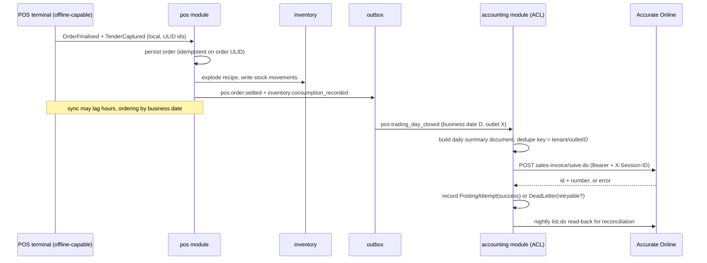

# F&B Mini-ERP and the Accurate Online Bridge

The concrete product go-blocks must be able to build. Every framework decision in the
sibling approach documents is judged against whether it makes this system cheaper to
build and cheaper to keep correct.

## 1. Scope

"Mini-ERP" here means the full operational span of a multi-outlet food and beverage
business — selling, cooking, buying, counting, paying people, closing the day — minus
the double-entry general ledger. The ledger, chart of accounts, fiscal periods, trial
balance, tax filing artefacts, and statutory financial statements live in Accurate
Online. go-blocks never posts a debit and a credit against its own accounts, because
the moment it does it owns a second ledger and inherits the obligation to reconcile two
sources of financial truth forever.

The boundary, stated precisely:

| Concern                                              | Owner     |
| ---------------------------------------------------- | --------- |
| Orders, order items, voids, discounts, service state | go-blocks |
| Stock on hand, movements, counts, batches, waste     | go-blocks |
| Recipes, yields, theoretical usage                   | go-blocks |
| Purchase requisitions, POs, goods receipts           | go-blocks |
| Shifts, attendance, labour hours                     | go-blocks |
| Cash drawer, tips, over/short                        | go-blocks |
| Customer identity, loyalty balance, consent          | go-blocks |
| Item cost snapshots used for operational reporting   | go-blocks |
| Chart of accounts, journals, ledger balances         | Accurate  |
| AR/AP ageing, payment application, statements        | Accurate  |
| Inventory valuation of record, period close          | Accurate  |
| Fixed assets, depreciation, payroll journals         | Accurate  |
| Tax reports, financial statements, audit pack        | Accurate  |

The one rule that keeps them from fighting: **go-blocks emits documents, never
journals.** A document is a business fact with a stable identity ("sales invoice
SI-JKT01-20260822-0001 for these lines at these prices"). A journal is an accounting
interpretation of that fact. If go-blocks ever computes which account a line hits, the
accountant's chart of accounts and the developer's mapping table become two competing
authorities. Emitting documents and letting Accurate's own posting rules turn them into
journals keeps exactly one authority for interpretation. The corollary: any figure
go-blocks reports that looks financial (COGS, margin, revenue) is labelled
_operational_ and is expected to be approximately, not exactly, equal to Accurate's —
with a reconciliation job that measures the gap rather than hiding it.

## 2. Bounded contexts and module map

| Module        | Aggregates                                       | Key entities                                                        | Team shape      |
| ------------- | ------------------------------------------------ | ------------------------------------------------------------------- | --------------- |
| `identity`    | User, Role                                       | Staff, RoleAssignment, PinCredential, Device                        | Platform        |
| `outlet`      | Outlet                                           | Outlet, Area, Terminal, OperatingHours, PriceBookAssignment         | Platform        |
| `menu`        | Product, Recipe                                  | Product, Variant, Modifier, ModifierGroup, RecipeLine, Yield        | Menu ops        |
| `inventory`   | StockItem, StockMovement                         | Ingredient, UoM, UoMConversion, StockLedgerEntry, StockCount, Batch | Supply chain    |
| `procurement` | PurchaseRequisition, PurchaseOrder, GoodsReceipt | RequisitionLine, POLine, ReceiptLine, PriceAgreement                | Supply chain    |
| `supplier`    | Supplier                                         | Supplier, SupplierItem, LeadTime, PaymentTerm                       | Supply chain    |
| `production`  | ProductionBatch                                  | BatchOrder, InputConsumption, OutputYield, WasteRecord              | Central kitchen |
| `pos`         | Order                                            | Order, OrderLine, LineModifier, Void, Discount, ServiceSession      | POS squad       |
| `payment`     | Payment, Settlement                              | Tender, PaymentAttempt, Refund, SettlementBatch, Reconciliation     | Payments        |
| `promotion`   | Promotion, PriceBook                             | Promotion, Rule, Coupon, PriceBookEntry, HappyHour                  | Menu ops        |
| `floor`       | FloorPlan                                        | Table, Section, Reservation, TableSession, Merge/Split              | POS squad       |
| `kds`         | TicketRoute                                      | Ticket, TicketItem, Station, PrepState, CourseTiming                | POS squad       |
| `aggregator`  | AggregatorOrder                                  | ChannelMenu, ChannelOrder, StatusMap, CommissionTerms               | Integrations    |
| `crm`         | Customer, LoyaltyAccount                         | Customer, Consent, PointLedger, Tier, Voucher                       | Growth          |
| `workforce`   | Shift, TimeEntry                                 | Roster, ClockEvent, BreakRecord, LabourCostSnapshot                 | People ops      |
| `cash`        | DrawerSession                                    | DrawerSession, CashCount, Payout, Deposit, OverShort                | Finance ops     |
| `tax`         | TaxProfile                                       | TaxRule, PBJTRate, ServiceChargeRule, TaxInvoiceRef                 | Finance ops     |
| `reporting`   | — (read models)                                  | DailySalesFact, ProductMixFact, VarianceFact                        | Analytics       |
| `accounting`  | PostingRequest                                   | DocumentMapping, PostingAttempt, ReconRun, DeadLetter               | Integrations    |

Two modules deserve a note.

**`tax`** exists as its own module because Indonesian F&B taxation is not VAT. Food and
beverages served by restaurants are excluded from PPN; the applicable tax is the
regional PBJT on food and beverages — the levy the industry still calls PB1 — capped at
10% by UU 1/2022 Art. 58(1) and set per region by local regulation. Three consequences
the data model must carry: the rate is a property of the outlet's regency/city, not of
the tenant; PBJT is a final regional tax and is not creditable input tax, so it never
behaves like PPN in the ledger; and a group operating both restaurants and a packaged
retail line can be simultaneously PBJT-liable on one revenue stream and PPN-liable on
another. Modelling tax as a single global percentage is the most common and most
expensive mistake in Indonesian POS software. Service charge is separate again — it is
revenue, commonly 5%, and when billed to the consumer it forms part of the PBJT base
while staying a distinct amount from the PBJT charge itself. `TaxRule`, `PBJTRate`, and
`ServiceChargeRule` are therefore versioned and scoped to the outlet's jurisdiction, and
every order snapshots the `tax_profile_id` and the rule versions it was priced under.

A version pointer is not enough on its own: if a rule row can be edited or deleted in
place, the pointer dangles and the historical order becomes unrecomputable — which is
exactly the situation a tax audit walks into. So the order stores an **immutable,
effective-dated snapshot of the resolved inputs**, not just the identifiers: the applied
PBJT rate, the service-charge rate, which components are inside the PBJT base, the
jurisdiction the rate came from, the effective date the resolution used, and a content
hash over that set. Rule rows themselves are append-only — a "change" writes a new
effective-dated version and never mutates a prior one — and reconciliation compares the
recomputed figure against the stored hash, so a silent rule edit shows up as a mismatch
instead of quietly rewriting history.

**`accounting`** is deliberately a module and not a library. It holds the
anti-corruption layer, the posting state machine, and the reconciliation runs. Nothing
outside it knows Accurate exists.

## 3. Aggregate and event design

All state-changing writes emit domain events into a transactional outbox in the same
database transaction as the aggregate mutation. The outbox is the only integration
boundary: aggregator callbacks, KDS pushes, read-model projections, and Accurate posting
all consume from it. Nothing does a synchronous HTTP call inside a business transaction.

Event naming is `<module>.<aggregate>.<past-tense>`, payloads are protobuf messages with
`tenant_id`, `outlet_id`, `occurred_at`, `actor`, and an `event_id` (ULID) that doubles
as the downstream idempotency key.

**POS sale.** `pos.order.opened` → `pos.order.line_added` (product, variant, modifiers,
qty, unit_price, price_book_id) → optional `pos.order.line_voided` (reason_code,
authorised_by) / `promotion.discount_applied` → `pos.order.finalised` (subtotal,
service_charge, pbjt_amount, total, tax_profile_id) → `payment.tender_captured`
(method, amount, processor_ref, tokenised_card_ref) → `pos.order.settled`. On settle,
`inventory.consumption_recorded` is emitted per recipe explosion, and
`accounting.posting_requested` is enqueued.

**Goods receipt.** `procurement.receipt_recorded` (po_id, lines with received_qty,
uom, unit_cost, batch, expiry) → `inventory.stock_received` → the accounting bridge
maps the receipt to Accurate. Note the receipt, not the PO, is the stock and cost event;
a PO is a commitment, not a movement.

**Stock count.** `inventory.count_opened` (scope, snapshot of system qty) →
`inventory.count_line_recorded` (counted_qty) → `inventory.count_closed` producing
`inventory.adjustment_posted` (per item, delta_qty, delta_value, reason). Freezing the
system quantity at open time is what makes the variance meaningful; counting against a
moving figure produces noise indistinguishable from theft.

**Recipe consumption.** Deterministic explosion of `RecipeLine` through
`UoMConversion` at settlement, not at order time — orders can still be voided. Sub-
recipes (a sauce produced by the central kitchen) resolve to the semi-finished stock
item, not recursively to raw ingredients, so central-kitchen yield loss stays attributed
to the kitchen.

**End of day.** `cash.drawer_closed` (declared vs expected, over_short) →
`pos.trading_day_closed` (immutable per outlet per business date; business date, not
calendar date, because a bar closes at 03:00) → `accounting.daily_summary_ready`. After
close, the day is append-only: corrections are new documents, never edits.

## 4. Inventory and costing

Three candidate methods. **FIFO** is the most faithful for perishables and the only one
that expresses expiry properly, but it needs layer tracking on every movement and, in a
kitchen where an ingredient is decanted, portioned, and partially wasted, the layers
stop corresponding to physical reality within a day. **Standard cost** — a fixed
expected cost per ingredient, revised monthly — gives clean theoretical plate costs and
instant menu-engineering answers, but drifts hard against volatile fresh produce, which
is most of an Indonesian kitchen's spend. **Weighted average moving cost** recomputes
unit cost on every receipt: `new_cost = (qty_on_hand * old_cost + received_qty *
received_cost) / (qty_on_hand + received_qty)`.

That formula has an undefined case that offline POS guarantees will happen, so the rules
have to be written down before any posting is enabled:

- **Zero or negative denominator.** An offline sale can drive `qty_on_hand` to zero or
  below before its receipt syncs, making the divisor zero or negative. Define the
  behaviour explicitly: hold `old_cost` unchanged when the denominator is `<= 0`, book
  the receipt at its own `received_cost`, and raise a negative-stock exception for
  operational correction rather than silently producing a nonsense or negative unit cost.
- **Negative stock as a first-class state.** Oversell is normal in F&B (the kitchen
  serves, the count catches up), so negative on-hand is a recorded state with its own
  variance report, not an error that blocks the sale.
- **Backdated receipts and arrival order.** Moving average is order-dependent: a receipt
  that syncs late produces a different running cost than if it had arrived on time. Fix
  the rule as "cost is computed in sync-arrival order, and a backdated receipt triggers a
  dated revaluation entry rather than a retroactive rewrite of already-posted COGS" —
  otherwise every late sync silently restates closed periods.
- **Revaluation.** Those revaluation entries are their own posting type with their own
  Accurate mapping, dated to the period they are recognised in, never to the original
  receipt's period if that period is closed.

Only with those four defined does the "difference is rounding-only" claim below hold;
without them the difference is method-based and unbounded.

Pick weighted average moving cost as the operational default, and carry standard cost
as a _second, parallel_ figure per ingredient used only for recipe costing and variance.
Moving average survives decanting, needs no layer bookkeeping, tolerates the out-of-
order arrival that offline sync guarantees, and — the decisive point — it can be matched
to Accurate, which supports both average and FIFO. Confirming the costing method actually
configured in the Accurate database is therefore an integration prerequisite, not a
detail: where both sides use average, operational and financial valuation drift only by
rounding and reconciliation can treat the difference as a tolerance. FIFO remains
available per-item for high-value, genuinely lot-tracked goods (imported beef, wine), but
a per-item method that differs from Accurate's produces method-based COGS and valuation
differences rather than rounding-only ones, so those items need a layer-level cost
comparison as their reconciliation rule rather than a tolerance — defined before
inventory posting is enabled at all. Batch and expiry are tracked independently of the
costing method for food-safety reasons regardless.

**Theoretical versus actual.** Theoretical usage is the recipe explosion of everything
sold. Actual usage is `opening + receipts + production_in - production_out - transfers -
closing` from the count. The difference is variance, and it decomposes into recorded
waste, recorded spoilage, over-portioning, unrecorded transfers, receiving errors, and
theft. Variance is only interpretable when waste is recorded as a first-class movement
with a reason code — `spoilage`, `prep_trim`, `staff_meal`, `customer_return`,
`training`, `breakage` — so the residual after subtracting explained waste is the number
worth investigating. An operator will accept 1-2% unexplained on dry goods; 8% on
protein is a staffing conversation.

**COGS without a ledger.** go-blocks computes operational COGS as the sum of
`quantity x moving_average_cost_at_movement_time` over consumption and adjustment
movements for the period. It is accrual-shaped and reported per outlet, per category,
and per menu item. It is explicitly _not_ the ledger COGS; Accurate derives that from
its own valuation of purchase invoices and adjustments. The reconciliation job compares
the two monthly and alerts on divergence beyond a threshold, which in practice catches
missing goods receipts and unposted adjustments faster than either system alone.

## 5. Local-first POS

The requirement is absolute: an outlet with a dead uplink keeps taking orders, printing
receipts, firing tickets to the kitchen, and taking cash. Network is an optimisation.

**On-device store.** SQLite per terminal, WAL mode, with the same protobuf-derived
schema as the server subset. Resident data: the outlet's menu tree, active price book
and promotions, tax profile, modifier groups, floor plan, staff credentials and
permission bits (PIN hashes, never plaintext), open orders and today's closed orders,
the local outbox, and a bounded loyalty cache — customer identifiers and point balances
for recently-seen customers only, never the full CRM, because a stolen terminal must not
be a full customer database breach.

**Identity.** ULID or UUIDv7 generated on device for every entity. Auto-increment is
disqualified for the obvious reason (two offline terminals both mint id 41) and the
subtler one: a server-assigned key means the terminal cannot reference its own rows in
its own outbox until it has synced, which defeats offline operation entirely. ULID/v7
are additionally lexicographically time-sortable, which makes index locality on the
server acceptable and makes event ordering approximately correct for free.

**Sync protocol.** Push is outbox-driven: append-only local event log, drained in order,
each event carrying its ULID as the idempotency key; the server returns the set of
accepted event ids and the client truncates only those. Pull is cursor-based against a
server change log — `GET /changes?since=<cursor>&scope=outlet:X` returning ordered
change records and a new cursor — with the cursor persisted locally so a terminal that
was off for a week resumes rather than refetching. Both directions must be safe to
replay arbitrarily; the test is "run the whole sync twice and diff the database".

**Conflict resolution, per entity type.** Orders never conflict: they are append-only
event streams owned by exactly one terminal for their lifetime, so the server accepts
whatever arrives. Stock does conflict, and last-write-wins on quantity is data loss —
stock syncs as _deltas_ (movements), the server sums them, and the absolute quantity is
always derived, never transmitted as a fact. Prices and promotions are server-
authoritative: the terminal takes them, never proposes them, and an order records the
`price_book_version` it was priced against so a mid-day price change does not
retroactively alter yesterday's margin. Master data (menu, staff) is server-
authoritative with a version vector. Loyalty accrual is delta-based and safe; loyalty
_redemption_ is not — it can overdraw a balance offline, which is a policy decision, not
a technical one (recommendation: allow redemption up to a small offline cap, absorb the
rare overdraw as marketing cost).

**What genuinely cannot work offline.** Card and QRIS both require an online authorising
party — QRIS in particular settles through the national switch, and there is no offline
QRIS authorisation to build. Cash works. So does account/tab and, at the operator's
risk, a manual card imprint fallback. Delivery aggregator orders cannot arrive at all
while offline; the aggregator will simply mark the store closed, which is the correct
behaviour and should not be worked around. Real-time inventory availability across
outlets, centrally-issued vouchers with global single-use semantics, and any
authorisation requiring head-office approval are all unavailable. Say so in the UI —
graceful degradation with a visible offline banner beats silent divergence.

**Numbering and clocks.** Receipt numbers are minted locally from a per-terminal
sequence with a terminal prefix (`JKT01-T03-0001742`) so they are globally unique
without coordination and gaps are attributable. Any number that must be gapless and
authority-issued — a PPN e-Faktur reference for the retail line — cannot be minted
offline and must be requested later, so the receipt carries a "tax invoice pending"
state rather than a fabricated number. Clock skew is handled by recording both the
device clock and a server-observed skew offset at each sync, storing events with
`occurred_at_device` plus `skew_estimate`, and ordering by ULID rather than by
timestamp. Business date is assigned by the drawer session, not the clock, which makes a
terminal whose battery died and reset to 1970 recoverable.

## 6. The Accurate integration

Verified facts about the integration surface, from Accurate's own documentation: OAuth
2.0 with a registered client id/secret yielding a bearer access token; a two-step
session model where `GET https://account.accurate.id/api/db-list.do` lists accessible
databases and `GET https://account.accurate.id/api/open-db.do?id=<db>` returns a session
id and a host; the host is itself a full origin including the scheme (`https://public.accurate.id`
for regular accounts, a per-tenant host on private cloud), so data calls go to
`<host>/accurate/api/<resource>/<action>.do` with nothing prepended,
carrying both `Authorization: Bearer <token>` and `X-Session-ID: <session>`; the host is
explicitly documented as changeable and clients are told to follow HTTP 308 redirects;
POST is the recommended method and nested collections are passed as indexed form
parameters (`detailItem[0].itemNo`); rate limits are a documented **8 calls per second
and 8 concurrent in-flight requests**, with the error response shape for a breach not
documented. An OpenAPI schema is published at
`https://account.accurate.id/open-api/json.do`.

Design consequences. The ACL is a single Go package exposing intent-shaped methods
(`PostDailySales`, `PostGoodsReceipt`) and nothing else; the indexed-form-parameter
encoding, the session lifecycle, and the 308 handling are all private to it.

**Redirect following is a credential-forwarding decision, not a transport detail.**
Requests carry two secrets — `Authorization: Bearer` and `X-Session-ID` — and Go's
default client strips `Authorization` when a redirect crosses to an unrelated host but
forwards custom headers like `X-Session-ID` regardless. A hand-written `CheckRedirect`
that "just follows 308s" therefore leaks the session id to whatever host the `Location`
header names. The ACL installs an explicit `CheckRedirect` that follows a redirect only
when the target is HTTPS and its host matches either the host returned by `open-db.do`
for this tenant or an explicit Accurate host allowlist; anything else is a hard error, not
a followed hop. Both credentials are re-attached deliberately per allowed hop rather than
inherited, so the forwarding rule is stated in one place instead of falling out of
library defaults. Session
acquisition is a supervised singleton per tenant database with re-open on 401/session
expiry and a host value that is re-read rather than cached to disk. Rate limiting is
client-side and explicit: a token bucket at 6/s against a documented 8/s, plus a
semaphore of 6 concurrent, because discovering the breach behaviour in production during
dinner service is not an acceptable way to learn it.

| go-blocks document                    | Accurate object                          | Verified                                                       |
| ------------------------------------- | ---------------------------------------- | -------------------------------------------------------------- |
| Daily sales summary per outlet        | `sales-invoice`                          | Resource verified; field mapping not verified                  |
| Cash/card/QRIS receipts               | `sales-receipt`                          | Resource verified; application semantics not verified          |
| Refund / sales void after close       | `sales-return`                           | Resource verified; field mapping not verified                  |
| Purchase order                        | `purchase-order`                         | Resource verified                                              |
| Goods receipt                         | `receive-item`                           | Resource verified; whether it must reference a PO not verified |
| Supplier invoice                      | `purchase-invoice`                       | Resource verified                                              |
| Stock count adjustment                | `item-adjustment`                        | Resource verified                                              |
| Waste / spoilage write-off            | `item-adjustment` with reason            | Resource verified; reason-code field **not verified**          |
| Inter-outlet transfer                 | item transfer resource                   | **Not verified** — resource name unconfirmed                   |
| Central kitchen production            | `manufacture-order` / `bill-of-material` | Resources appear in schema; suitability **not verified**       |
| Ingredient / menu item                | `item`                                   | Resource verified                                              |
| Outlet                                | `branch`                                 | Resource verified                                              |
| Supplier                              | `vendor`                                 | Resource verified                                              |
| Walk-in / channel customer            | `customer`                               | Resource verified                                              |
| Staff                                 | `employee`                               | Resource verified                                              |
| Aggregator commission, tips, rounding | `journal-voucher`                        | Resource verified; use as escape hatch                         |
| Bank deposit of daily cash            | `bank-transfer`                          | Resource verified; field mapping not verified                  |
| Payroll journal                       | out of scope                             | Accurate-side                                                  |

Every unverified row must be confirmed against a sandbox database before that document
type is enabled, and the ACL should fail closed on an unmapped document rather than
guessing a field name.

**Daily summary versus per-transaction.** Post daily summaries. A single mid-size
outlet does 300-800 covers a day; twenty outlets at 8 calls per second means per-
transaction posting spends the entire rate budget on invoices that no accountant will
ever open individually, and it puts trading-hours availability of a third-party API on
the critical path of a sale. One `sales-invoice` per outlet per business date per
revenue category, plus a matching `sales-receipt` set per tender type, plus one
`journal-voucher` for aggregator commissions and rounding, is 4-6 calls per outlet per
day. Per-transaction posting is justified only where a named B2B customer needs an
individual invoice and AR ageing — corporate catering, house accounts — which is a
small, bounded exception routed through the same ACL.

**Idempotency and double posting.** Each posting is keyed
`tenant:outlet:business_date:document_type:revision`, stored as a `PostingRequest` row
with a unique constraint, and the returned Accurate object id is stored against it. The
key is minted before the call and the row is written before the call, so a timeout that
actually succeeded is discovered by read-back (`<resource>/list.do` filtered on the
number the ACL itself deterministically generated) rather than resolved by a blind
retry. Never retry a `save.do` on an ambiguous outcome without a read-back first — this
is the single most likely source of duplicated revenue in the whole system.

`revision` is not a licence to post the same day twice. A revision row persists the
predecessor `PostingRequest` id and the Accurate object id it supersedes, and it resolves
to exactly one of two shapes: an edit of the predecessor document where the period is
still open and Accurate permits it, or a reversing document plus a corrected one where
the period is closed or the document is locked. Which shape applies is a property of the
document type and is recorded on the row.

The reversing shape creates **two** Accurate documents, so one object-id column cannot
represent it. A revision row therefore carries a distinct child posting attempt per
document it creates — each with its own Accurate object id, document type
(`reversal` or `correction`), and terminal state — and the parent row is only
`settled` once every child has reached a terminal state. The state transitions are
explicit: `pending → reversal_posted → correction_posted → settled`, with a stall at
`reversal_posted` being an alertable condition rather than a silently half-applied
correction. Reconciliation nets the whole family — predecessor plus reversal plus
correction — against the period, which is the only way it can prove the pair actually
cancels the predecessor rather than assuming it did.

**Failure handling.** Postings run in the background job block with bounded exponential
backoff and jitter. Non-retryable failures (validation, unmapped master data) go to a
dead-letter queue as a redacted repair envelope — `Authorization` and `X-Session-ID`
dropped entirely, customer and employee PII and payment references masked field by field,
only the identifiers and error detail a repair actually needs retained — with a repair
action, a bounded retention, and access limited to the finance-repair role.

Redacted-only is not replayable, though, and replay is the whole point of the queue. The
envelope therefore also pins **what to rebuild the request from**, rather than storing the
request itself: the immutable outbox record id the posting was derived from, the payload
builder version, and a content hash of the request that failed. Replay re-derives the
request from that outbox record through the same builder version and refuses to proceed if
the recomputed hash does not match the stored one — which catches a rule or mapping change
between failure and repair instead of silently posting a different document. The outbox
record is the source of truth for replay and month-end backfill alike; the dead-letter
envelope is diagnosis plus a pointer, never a second copy of the payload. Backfill is the same path with an explicit
date range, and because keys are deterministic, replaying a month is safe. **If Accurate
is down during trading hours, nothing happens** — that is the whole point of daily
summary posting plus outbox. Selling never touches Accurate. The alert threshold is a
posting older than 24 hours, not a failed call.

**Master data ownership.** go-blocks owns the menu and recipes; Accurate owns nothing
about them. Ingredients and purchased goods are owned by go-blocks and pushed to
Accurate as `item`, because procurement and stock counting happen in go-blocks. The
chart of accounts, tax codes, and payment terms are owned by Accurate and pulled. The
customer list is split: aggregator and walk-in traffic maps to a small set of generic
customer records in Accurate (one per channel), while named B2B customers are owned by
Accurate and pulled, because they carry AR. Every synced master record stores the
Accurate id in a `DocumentMapping` table; no mapping is inferred from names.

**Reconciliation.** A nightly job reads back the prior day's posted documents and
compares totals, tender mix, and item quantities against go-blocks' own read models,
writing a `ReconRun` with per-check pass/fail. This is the control that makes the whole
"two systems, one truth each" arrangement defensible: divergence is detected within a
day by a machine rather than in month-end close by a human.

## 7. Reporting without a ledger

| Report                          | Source                                                              |
| ------------------------------- | ------------------------------------------------------------------- |
| Daily sales by outlet           | `DailySalesFact` projection from `pos.order.settled`                |
| Product mix and attachment rate | Order lines with modifier expansion                                 |
| Void and discount analysis      | Void/discount events joined to authorising staff                    |
| COGS and margin per item        | Recipe explosion x moving average cost, vs menu price               |
| Labour cost percentage          | `workforce` time entries x rate ÷ net sales, per hour band          |
| Inventory variance              | Theoretical vs actual per count period, net of coded waste          |
| Cash over/short                 | Drawer declared vs expected, per session and per cashier            |
| Aggregator net revenue          | Channel gross less commission, from `aggregator` + settlement files |
| Tax liability estimate          | PBJT base x outlet rate; a check figure, not a filing               |

Every one of these is answerable from go-blocks alone, which is the justification for
the boundary: the operator's daily decisions never wait on the accountant's close. The
ledger answers a different set of questions — statutory statements, tax filings, AP
ageing — and those are correctly Accurate's.

## 8. Compliance touchpoints

Delivery addresses and phone numbers are the highest-volume PII in the system and the
most casually handled; they must be classified at the proto level so the compliance
blocks encrypt, redact in logs, and retain them on a schedule automatically. Aggregator
orders arrive with masked customer contacts — do not de-mask or enrich them.

Payment card data: never store a PAN, never log one, never let one reach the domain
model. Tokenise at the terminal or gateway and persist only a token, last four, scheme,
and processor reference. That is an architectural property rather than a policy document
— if a PAN cannot be represented in the schema, it cannot leak from it — but it is the
first move in PCI scope reduction, not the whole of it. The boundary still has to be
stated explicitly: where tokenisation or P2PE actually happens (terminal or gateway), how
the components connected to it are segmented from the rest of the estate, which controls
are the provider's responsibility under its own attestation and which remain the
merchant's, and which of the remaining components a qualified assessor has to validate.

The audit trail on voids, discounts, refunds, price overrides, and drawer no-sales is
a fraud control before it is a compliance artefact. It must record the authorising
staff identity (a supervisor PIN, not the shift's shared login), the reason code, the
before and after values, and the terminal — and it must be append-only and survive
offline operation, which means audit records ride the same outbox as everything else.

Staff data under UU 27/2022 (PDP) gets the same treatment as customer data: lawful
basis recorded, retention scheduled, access controlled. Biometric clock-in, if used, is
sensitive personal data and needs explicit consent plus a non-biometric alternative.

Retention overrides erasure, but only for the records statute actually names. UU 8/1997
Art. 11 applies its ten-year period to company accounting records — the books and the
supporting financial-administration documents underlying them — measured from the end of
the fiscal year rather than from the date of the individual transaction; it does not put
every field the system happens to store under the same clock (confirm the scope and
period with counsel per entity). A customer erasure request
therefore anonymises the _customer_ dimension — name, phone, address, loyalty identity —
while the transaction, its lines, and its tax figures survive as a de-identified fact.
The retention block must express this as a per-field policy, not a per-record delete.

## 9. Phased delivery plan

| Phase | Ships                                                                                                        | go-blocks components exercised                                      | Business value                              |
| ----- | ------------------------------------------------------------------------------------------------------------ | ------------------------------------------------------------------- | ------------------------------------------- |
| 1     | Single-outlet POS: menu, order, cash tender, receipt print, offline-first SQLite, daily Z-report             | core resources, local-first data layer, identity/PIN, audit, outbox | One real outlet can trade and close the day |
| 2     | Card + QRIS tenders, drawer sessions, shift close, discounts and voids with supervisor auth                  | payments ACL, statemachine, audit as fraud control                  | Full tender mix; cash accountability        |
| 3     | Accurate bridge: daily sales summary, sales receipts, reconciliation job, dead-letter repair                 | jobs, anti-corruption layer, idempotency, recon                     | Accountant stops re-keying sales            |
| 4     | Inventory: ingredients, recipes, consumption on sale, stock counts, waste codes, moving average cost         | inventory ledger, UoM, projections, reporting                       | Theoretical vs actual; first COGS number    |
| 5     | Procurement: suppliers, PR/PO approval, goods receipt; pushed to Accurate as receive-item / purchase-invoice | workflow, approvals, ACL breadth                                    | Purchasing control; AP stops being email    |
| 6     | Multi-outlet: outlets, price books, transfers, central kitchen production and yield, consolidated reporting  | multi-tenancy, tenant/row policies, analytics                       | Group-level visibility; scale to N outlets  |
| 7     | Aggregator integrations (GoFood/GrabFood/ShopeeFood), channel menus, commission journals                     | integration block, webhooks, retry, mapping                         | Delivery revenue in one operational view    |
| 8     | CRM and loyalty, promotions engine, table/floor management, KDS, workforce and labour cost                   | crm, consent, promotions, realtime push, workforce                  | Margin and labour levers; guest retention   |

Phase 1 is deliberately the smallest tradeable unit: without offline-capable cash
selling and a defensible end-of-day, nothing else matters, and everything else can be
added to an outlet that is already live.

## 10. Open questions

1. **Costing method of record.** Options: weighted average moving cost everywhere;
   moving average plus per-item FIFO for lot-tracked goods; standard cost with periodic
   revaluation. _Recommendation: moving average with per-item FIFO opt-in, and standard
   cost kept as a parallel figure for recipe costing only._ Needs the accountant's
   confirmation of what Accurate is configured to use.
2. **Posting granularity.** Daily summary versus per-transaction versus hybrid.
   _Recommendation: daily summary, with a per-transaction exception for named B2B
   customers._ Requires finance to accept that individual retail invoices do not exist
   in the ledger.
3. **Item master ownership.** go-blocks-owned with push, Accurate-owned with pull, or
   bidirectional. _Recommendation: go-blocks owns ingredients and menu items and pushes;
   Accurate owns COA, tax codes, and named customers and is pulled._ Bidirectional sync
   of any entity should be refused.
4. **Offline loyalty redemption.** Block offline, allow up to a cap, or allow freely.
   _Recommendation: allow up to a small per-transaction cap and absorb overdraws._
   Business decision, not technical.
5. **Tax invoice handling for any PPN-liable revenue line.** Whether the group has a
   non-restaurant revenue stream requiring e-Faktur at all, and if so whether go-blocks
   requests numbers or the accountant issues them from Accurate. _Recommendation:
   Accurate issues; go-blocks holds a pending-reference state._
6. **Aggregator reconciliation authority.** Trust the aggregator's settlement report, or
   reconcile line-by-line against orders received. _Recommendation: reconcile, and treat
   unmatched orders as a dispute queue_ — commission and cancellation disputes are
   material in Indonesian delivery.
7. **Terminal trust model.** Full outlet dataset resident versus minimal cache with
   server authorisation for sensitive reads. _Recommendation: minimal — bounded loyalty
   cache, no full CRM on device_, accepting reduced offline personalisation.
8. **Business date cutover per outlet.** Fixed group-wide cutover, per-outlet
   configuration, or drawer-session-driven. _Recommendation: drawer-session-driven with a
   per-outlet default_, since bars and breakfast outlets genuinely differ.
9. **Whether production/manufacturing posts to Accurate at all.** Options: post
   `manufacture-order`, post the net effect as `item-adjustment` pairs, or keep central
   kitchen valuation purely operational. _Recommendation: start with adjustment pairs_ —
   fewer unverified fields, same valuation outcome — and revisit once the
   `manufacture-order` mapping is confirmed in a sandbox.

## Sources

- [Accurate Online — API Integration](https://accurate.id/api-integration/)
- [Accurate Online — API Example (auth, open-db, X-Session-ID, host, endpoint format)](https://accurate.id/api-integration/api-example/)
- [Accurate Online — Batasan Pemanggilan API (rate limits)](https://accurate.id/api-integration/batasan-pemanggilan-api/)
- [Accurate Online — public OpenAPI schema](https://account.accurate.id/open-api/json.do)
- [Accurate Online — developer API docs (requires developer account)](https://account.accurate.id/developer/api-docs.do)
- [Cara Penggunaan API Accurate Online — ABC Kotaraya](https://abckotaraya.id/penggunaan-api-accurate-online/)
- [DJP — Makan di Restoran Tidak Kena PPN](https://www.pajak.go.id/en/node/81110)
- [Bapenda Jakarta — Pajak Restoran vs PBJT Makanan dan Minuman](https://bapenda.jakarta.go.id/artikel/pajak-restoran-vs-pbjt-makanan-dan-minuman-apa-bedanya)
- [Ortax — Ketentuan Pajak Restoran Pasca UU HKPD](https://ortax.org/pbjt-makanan-minuman)
